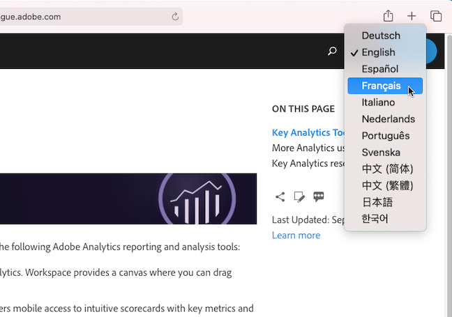
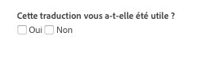
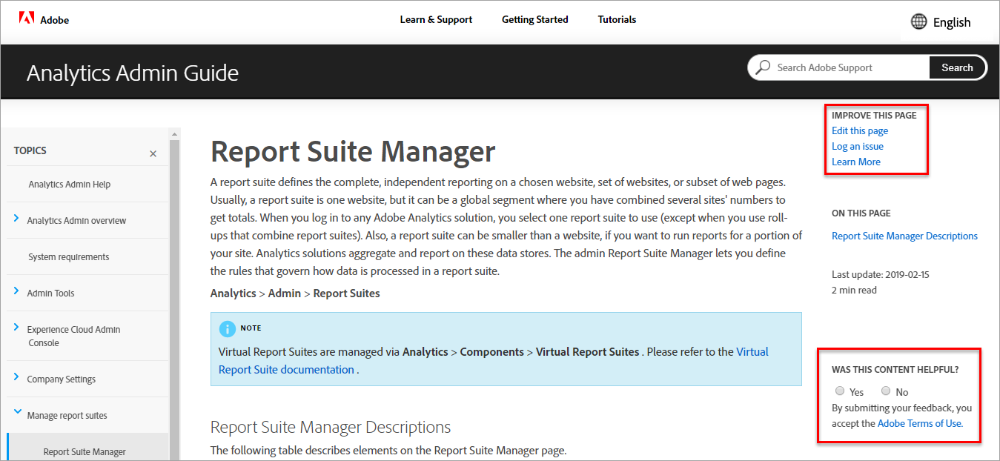

# Language Support for Adobe Experience Cloud Product Documentation

Adobe recognizes that you rely on product documentation, help, and support content to be readily available in languages supported by Adobe products. To realize this goal, Adobe offers a unique translation experience that enables you to select the language of your choice and to provide feedback on the quality of translated content.

## Select a language

You can view Adobe Experience Cloud product documentation in most languages.

1. Navigate to Experience Cloud [product documentation](https://helpx.adobe.com/support/experience-cloud.html).

1. Browse to find a help page (for example, [Analytics](https://docs.adobe.com/content/help/en/analytics/landing/home.html)).

1. Click the Language Selector (world icon), then choose a language.

   

   The page displays in the language you selected.

   

   In cases where your language version is not yet available, Adobe can automatically translate your content. Adobe's automatic translation service displays a message at the top of the page in a blue field:

   

   The content may be rendered in your language automatically, or you can click a link to trigger the translation. (This scenario may occur when you have clicked on the hyperlink to return to the English source from the translated page. It gives you the option of viewing the translated page on-demand.) You can at any time return to the English source.

   Occasionally, the English source content might have been recently updated and published before the translations were completed. Upon clicking on your language in the dropdown menu, you will see a notification — in the light-blue horizontal bar at the top of the page — informing that the page was automatically translated from the previous version, with updated content to be available soon. You will be offered the choice to view the most recent English source content in a new browser window, if you prefer.

## Why use automatic translation

Adobe takes advantage of automatic translation capabilities to publish product support content in various languages, as close to content creation time as possible. Because support content is critical to product usage, we prioritize the translation of content by skilled professionals, but we may also opt for automatic translation where velocity and urgency matter most.

Automatic translation is ubiquitous on the internet and its usage is generally accepted as a powerful information-gathering tool. It has been widely adopted for knowledge base content, where there may be little to no human intervention. Although there have been major technological breakthroughs in recent years, automatically-generated translations may contain occasional inaccuracies and errors in language and meaning.

### Automatic Translation via the Browser

If you have set your browser preferences to automatically translate any page into your language, be aware that the resulting translations will differ from those obtained through the Adobe page. That is because the service offered by the browser may be stock translations, while the Adobe translations will have been customized to adhere to Adobe style guidelines and terminology. To obtain optimal automatic translation results, we recommend that you either disable the browser option for this specific site in your browser preferences, or click **Never translate** when it displays.

### Known Issues

You might occasionally experience issues with the automatic translation output, such as incomplete translations, corrupted characters or page layout issues. These are caused by any of the various authoring, publishing, or translation technology tools Adobe uses. We will make every effort to list the known issues here
below.

| **ISSUE ID** | **DESCRIPTION**                                                                     | **STATUS** |
|--------------|-------------------------------------------------------------------------------------|------------|
| G11N3558     | Some Audience Manager pages are half English and half translated (French, Spanish). | OPEN       |

### Feedback

Whenever content is automatically translated, either by default or user action, there is the option to provide feedback to Adobe about the translations. In the
light-blue horizontal bar at the top of the page, you may answer “Yes” or “No” to the question, “Was this translation useful?”. Adobe collects this valuable
metric and analyzes the compiled data in order to make decisions about content translation. We value your feedback and encourage you to respond.

In the future, we plan to allow you to provide more extensive feedback, in the form of logging an issue, making suggested improvements, and even requesting
additional languages. Some of these features are already available on the English pages. In the long run, we believe this will help Adobe improve the user
experience on these pages.

### Translation Disclaimer
 
Adobe uses a machine translation program to translate text into a number of different languages. Please be aware that computerized translations are literal translations and may contain errors. Adobe does not warrant the accuracy, reliability, or timeliness of the translations provided. Adobe will not be responsible for any losses or damages incurred due to reliance on the accuracy or reliability of translated information. If there are differences between English and another language, the English version controls.
 
If you would like to report a translation error or inaccuracy, we encourage you to please contact us.
