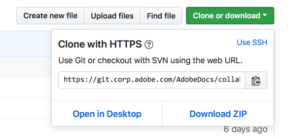

# Set up Git repository locally for documentation

This article describes the steps to set up a git repository on your local machine, with the intent to contribute to Adobe documentation. Contributors may use a locally cloned repository to add new articles, do major edits on existing articles, or change artwork.

> [!IMPORTANT]
> If you're making only minor changes to an article, you *do not* need to complete the steps in this article. You can simply click the Edit icon and make text edits in your browser.

## Overview

To contribute to Adobe documentation, you can fork the appropriate repository into your own GitHub account so that you have read/write permissions. Then, you can can make and edit Markdown files locally by cloning the corresponding documentation repository. Then you use pull requests to merge (submit) changes into the read-only central shared repository.

* Determine the appropriate repository
* Fork the repository to your GitHub account
* Choose a local folder for the cloned files
* Clone the repository to your local machine
* Configure the upstream remote value

## Determine the repository

You fork the appropriate repository into your own GitHub account so that you have read/write permissions there to store your proposed changes. Adobe Experience Cloud documentation resides in several different repositories at [github.com](https://www.github.com/adobedocs). 

1. If you are unsure of which repository to use, then visit the article using your web browser. Select the **Edit** link (pencil icon) on the upper right of the article. (If you don't see an Edit link, that content is not yet available in GitHub.)

To contribute to Adobe documentation, you can make and edit Markdown files locally by cloning the corresponding documentation repository. Then you use pull requests to merge changes into the read-only central shared repository.

<!---

If you're new to GitHub, watch the following video for a conceptual overview of the forking and cloning process:

>[!VIDEO https://channel9.msdn.com/Blogs/CoolMoose/Git-Repository-Setup/player]
-->

## Fork the repository

Using the appropriate repository, create a fork of the repository into your own GitHub account by using the GitHub website.

A personal fork is required since all main documentation repositories provide read-only access, which means you cannot make changes directly on content in the repositories. To make changes, you must submit a pull request (PR) from your fork into the main repository. To facilitate this process, you first need your own copy of the repository, in which you have write access. A GitHub *fork* serves that purpose.

1. Go to the main repository's GitHub page and click the **Fork** button on the upper right.

   

1. If you are prompted, select your GitHub account tile as the destination where the fork should be created. This prompt creates a copy of the repository within your GitHub account, known as a fork.

1. Choose a folder name that should be easy for you to remember and type.

   Some of the repositories can be large. Choose a location with available disk space.

   > [!NOTE]
   > Avoid choosing a local folder path that is nested inside of another git repository folder location. While it is acceptable to store the git cloned folders adjacent to each other, nesting git folders inside one another causes errors for the file tracking.

## Create a local clone of the repository

By creating a clone of the forked repository, you download a copy of the files to your computer. When you're ready, you can push edits from your local drive to the forked repository on the server. Then you can submit a pull request to merge the edits upstream to the main repository. 

These steps assume you are using GitHub Desktop. If you are using a different client, make the appropriate adjustments.

1. Click **Clone or download** and then choose **Open in Desktop** to pull a copy of the repository (your fork) down to your computer on the current directory.

   

1. Use GitHub Desktop to keep the local files in sync with the forked repository.

For details, see [GitHub Desktop Documentation](https://help.github.com/desktop/).
