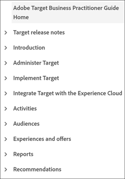

# Authoring style guidelines for external contributors{#guidelines}

This page provides editorial guidelines for external authors creating content or updating existing content on Experience League. Before you begin, ensure that you:

* Get familiar with [Markdown](markdown.md) authoring 
* Check the spelling and grammar in your articles
* Use a friendly tone, consistent presentation, and simple sentences to improve machine translation
* Follow [best-practices](#writing-tips) and editorial standards on this page

## Style guidelines{#style-guidelines}

Keep the following in mind when writing documentation.

* **Write concisely**: Don't waste words. Keep sentences short and concise. Keep your article focused. Keep the number of notes to a minimum.
* **Focus on the audience and purpose**: Before you begin writing, clearly determine who the customer is and what task he or she is trying to accomplish. Write your article to help that customer do that task.
* **Use examples**: Provide examples to explain concepts.
* **Organize your content**: Create sections to divide instructions into more manageable groups of steps. Use a screenshot when it adds clarity.

## Best practices of technical writing{#writing-tips}

Technical writing, particularly for software documentation, is a specialized industry. Even the most prolific novelist gets flustered when attempting technical writing--not because the material is complex or technical, but because it's not easy making complex, technical information _simple_. To succeed, your content must be structurally consistent, scannable, reusable, and flow through the publishing pipeline without structure and syntax errors. 

The following sections describe common issues that new writers must watch out for:

### Headings not separated by text (double headings){#double-headings}

If you have two headings with no text separating them, add missing text (to introduce the second topic heading). Or, you can remove one of the headings. The second one is probably unnecessary. 

For example, _Overview_ serves no purpose here:

* Also, if your second heading happens to be _Overview_, it's probably unnecessary. Your H1 and first paragraph serve as the conceptual overview about the article's topic. 

* Similarly, for SEO purposes, stand-alone headings like _Overview_ and _Introduction_ aren't useful by themselves. Name the product or feature that you're introducing. (Example: _Overview of Fallout reports_)

### Inconsistent cross-reference headings{#maps}

Use _More information_ headings for cross-reference lists (or maps). Example:

**Guidance for cross-reference lists**

* Use a bullet list for the cross-references
* Use italics for the formal names of guides or page names (when not using link text)
* Do not punctuate the heading (or any heading)
* Avoid numbers in headings

### Mismatching TOC entry, breadcrumb, and page name{#toc}

Because we manually manage the TOC (table of contents) file, these mismatches are easy mistakes. Ensure that your TOC entry matches your page name (H1). Also, ensure that it closely matches the breadcrumb. 

**Guidance on TOCs and lists**

* You might need to shorten your TOC entry, but it must clearly relate to the page name and breadcrumb.
* Breadcrumbs are pulled in from the title metadata, so they can differ (for SEO purposes). 

### Quotation marks instead of italics{#quotes}

It's hard to resist adding quotes around a word or phrase. However, quotes are intended for quoting speech, and almost never used in product documentation.

**Guidance on quotation marks**

* Usually, italics work better than quotation marks (for error messages, unique or foreign words, and so on).
* For interface elements, use bold and UICONTROL.

### Procedures{#steps}

Writing a procedure (the _task_ content type) is not a talent that we are born with. Building a readable, clear procedure takes practice.

**Guidance for steps**

* A procedure is a series of steps. A step is a brief, numbered, _single-sentence_ command.
* Begin each step either with a verb or the _To_ infinitive (to orient the reader to the goal, as in, _To stay signed in, enable **Stay signed in**_). If a step has a specific goal within the overall procedure, mention the goal before the action.
* If you have information about the step (a content type called _step info_, add it after the step (indented with the step) or after the asset (a screenshot, video, or a list of interface descriptions).
* If your step has two actions (such as, _Select this, then that_), write it as a single, brief sentence.
* Limit your task to about seven to ten steps. If you're creating more than ten steps in one task, you likely need to break it into two tasks. Use your best judgment here.
* In product documentation, do not use headings as steps. (Exception below for tutorials.)
* For multi-page tutorials, headings as steps can be allowed. However, do not number them. Rather, spell out _Step 1:_, _Step 2:_, and so on.

**Example procedure** 

Here is a well-structured procedure for signing in at Adobe:

To sign in at Adobe:

1. On `Adobe.com`, select **Experience Cloud**.
1. Select **Sign-in**.
1. Select **Personal Account**.
1. To stay signed in, select **Stay signed-in**.
1. Type your name and password.
1. Select **Sign-in**.

### Parallel lists{#lists}

Using parallel construction for lists makes reading and scanning easy. Lists include a TOC (table of contents), bullet (unordered) lists, or numbered lists.

Example TOC with parallel entries:

The preceding TOC is a good example because:

* Conceptual parent entries are nouns or noun phrases
* Procedures (tasks) are active verbs (not gerunds)
* All entries use sentence capitalization

## Title and description metadata{#metadata}

_Title_ and _description_ metadata are important for SEO, content discovery, and content quality scores on Experience League. 

Here are examples of titles and descriptions:

**Descriptions for concept articles**

* _Learn about segments in Adobe Analytics. Get help on configuring the Segmentation panel in a workspace._
* _Find help on using segments in a Page Views report in Adobe Analytics._

**Descriptions for procedure/task articles**

* _Learn how to create a segment in Adobe Analytics._
* _Create a segment in Adobe Analytics. Learn how to select, configure, and run a report based on the segment you create._ 

The one you use depends on the size and scope of the article.

**Title for a concept article**

* _Segments in Page Views reports_

**Title for a procedure/task article**

* _Create a segment for a Page Views report_

(Remember, the pipe and product name are added automatically to titles.)

## Ways to improve clarity (and Acrolinx scores){#tips}

Here are simple ways to improve content design, clarity, and readability. These also help improve Acrolinx style scores and CQI scores on ExL.

| Guidance | About |
|---|---|
|Use active voice|Change passive voice to active voice|
|Use present tense| **Weak:** *Campaign v8 will release in June.* 
**Strong:** *Campaign v8 releases in June.*
Present tense is always easier to read for customers.  |
|Avoid weak, needless adverbs|*Very*, *extremely*, *incredibly*.... 
Adverbs are extra words that do not add significant meaning if you use strong and precise verbs, clauses, and adjectives.|
|Use strong verbs for titles and [TOC entries](#using-toc)|Examples:
**Weak:** *Trait creation and management* 
**Strong:** *Create and manage traits* |
|Use sentence [capitalization](https://docs.microsoft.com/en-us/style-guide/capitalization)| When in doubt, don't capitalize. In headings, use sentence-style capitalization. Capitalize proper nouns and the first word after a colon. In procedures, match capitalization that you see in the interface. |
|Learn these small tips for clarity|<ul><li>Avoid *In order to* (it adds no meaning). All you need is *to.*</li><li>Avoid *Utilize.* It might sound more technical, but it isn't. *Utilize* means *to make good use of, especially of something that was not intended for the purpose but will serve*.</li><li>Avoid semi-colons: Use a period instead and begin a new sentence. Semi colons introduce needless complexity.</li><li>Colons: Use colons to introduce a list. Use colons sparingly within sentences. Capitalize the first word after a colon in a sentence.</li><li>Use the Oxford comma (three commas in a list).</li><li>Keep sentence length under 39 words.</li><li>Navigation: use _go to_ or _navigate to_.</li><li>Avoid raw URL text (use user-friendly link text) unless displaying the path is important information.</li></ul> |
|Use a spell checker in VSC|Install Code Spell Check (extension) in Visual Studio Code.|
|Change _click_ to _go to_ or _select_  |_Click_ is a device-specific word (with accessibility issues), and the trend is to move away from it. Here are suggestions for changing it:<ul><li>Navigation: _Go to File > Print_.</li><li>Clicking: _Select File > Print_ or _Select OK_. </li></ul>See [Describing interactions with the UI](https://docs.microsoft.com/en-us/style-guide/procedures-instructions/describing-interactions-with-ui) for more ideas on the best word choice in various situations.|
|Run Acrolinx in VSC |Acrolinx checks for style and grammar issues. It checks URLs, terminology, spelling, and more. It helps you improve your clarity and improves translation on Experience League content. |

{style="table-layout:auto"}

A few more best practices and resources:

* [Scannable content](https://docs.microsoft.com/en-us/style-guide/scannable-content/): Help readers find what they need quickly, or recognize just as quickly when they're not where they need to be. Writing to facilitate scanning can help.
* **Numbers:** In body text, spell out whole numbers from zero to nine, and use numerals for 10 or greater. See [Numbers](https://docs.microsoft.com/en-us/style-guide/numbers).
* Write like you speak, project friendliness, and get to the point fast.

See [Top 10 Writing Tips](https://docs.microsoft.com/en-us/style-guide/top-10-tips-style-voice) in the [Microsoft&reg; Style Guide](https://docs.microsoft.com/en-us/style-guide/welcome/) for more information.

## Alt-text{#alt-text}

Add meaningful alt-text to your assets (images). Consider alt-text that matches:

* The goal customers can accomplish (task or concept name)
* The feature or page you're showing
* The icon name that you're showing

Google considers the alt-text in SEO results.

## Localization - DNL and UICONTROL{#localization}

You do not need to worry about whether your product is localized or the languages that ExL uses. However, you help improve the quality of localization by applying the following two (required) Markdown tags where appropriate:

* `DNL`

  DNL means _do not localize_. You use it only for trademarked Adobe product names, all of which must remain in English.

  Syntax examples: `[!DNL Adobe Campaign]` or `[!DNL Workfront]`

  DNL is not intended for file names or URLs.

* `UICONTROL` 

  UICONTROL indicates an interface control (such as an option, field, tab, page, group of options, or feature name in the UI).

  Syntax example: `Select **[!UICONTROL Project]**, then select **[!UICONTROL Save]**.`

>[!IMPORTANT]
>
>You must apply these tags prior to localizing your content.

### Using Adobe in product names{#product-names}

For corporate identity, we usually include _Adobe_ in the first reference of a product at the guide level. Depending on space considerations, you can drop Adobe in a heading, but then the first reference in the body copy should include the full name. Certain products, such as _Adobe Audition_ and _Adobe Premiere Pro_, require the use of Adobe on first or most prominent reference in every piece of collateral because it is part of the legal, trademarked name. 

## First paragraphs{#firstparas}

Your first paragraph should define the topic and describe what the reader learns from reading the article.

Sample first paragraph (concept):

  _Audiences are collections of visitors (a list of visitor IDs). Adobe's audience service manages the translation of visitor data into audience segmentation. As such, creating and managing audiences is similar to creating and using segments, with the added ability to share the audience segment to the Experience Cloud._

Sample first paragraph (task):

  _Create the customer attribute source (CSV and FIN files) and upload the data. You can activate the data source when you are ready. After the data source is active, share the attribute data to Analytics and Target._

### SEO tips for first paragraphs{#seo}

* Include search terms in first paragraphs.
* Use terms that readers use.
* Include synonyms and, if necessary, previous usage of terms. For example, "The Experience Cloud ID Service (ECID), previously known as _visitor ID_ or as acronyms like MID, MCVID, provides a universal, persistent ID that identifies visitors."
* Include SEO terms in links.
* Avoid placing essential terms in complex tables. Complex tables don't yield reliable search results. Text in images is not search. Captions are searched.

## Capitalization{#capitalization}

* Adobe style uses sentence-style capitalization for all titles, headings, subheadings, and page navigation elements.
* All words are lowercase except the first word and proper nouns, such as the names of brands, solutions, and services.
* Match the capitalization in the product names of tools, options, menu items, dialog boxes, and fields.

## Table of contents{#using-toc}

The `TOC.md` is your table of contents. Each guide should have one. 

**Editorial guidance for a TOC**

* Capitalization: Always use sentence case for every entry (not including acronyms). Capitalize only formal product names or interface elements (pages, tabs, fields, options, and so on.). Match the UI when referring to it.
* Verb form and parallelism: Use imperative verb and avoid gerunds. TOCs are lists so always try to keep lists parallel most of the time. There are exceptions that sometimes can't be avoided. For conceptual pages, use nouns and noun phrases. For tasks, use verbs.

**Syntax guidance**

* A section heading (parent) in the TOC cannot be a link; it does not have a page with content. It should contain an anchor such as `{#processing-rules}`. 
* You must use proper syntax for TOC section headings (for example, `+ Processing rules {#processing-rules}`) and TOC article links (for example, `+ [Article name](article.md)`).
* TOC article entries can be a shortened version of the article title. Follow the standards for writing overviews, concepts, and tasks in this document.
* Avoid adding the same file multiple times to a TOC (or to multiple TOCs). Doing so causes odd behavior.
* If your repo contains multiple user guides, your user guide directories must be at the same level, such as the subdirectories within the `help` directory. Each user guide directory must have a TOC file. No nesting user guides. 

## Bold and italics{#bold}

* Use bold text only for interface elements that you click in a procedure (and with UICONTROL).
* Use italics for emphasis or when a word is confusing without it. For example, a foreign word, or when you're describing a word or defining a term.
